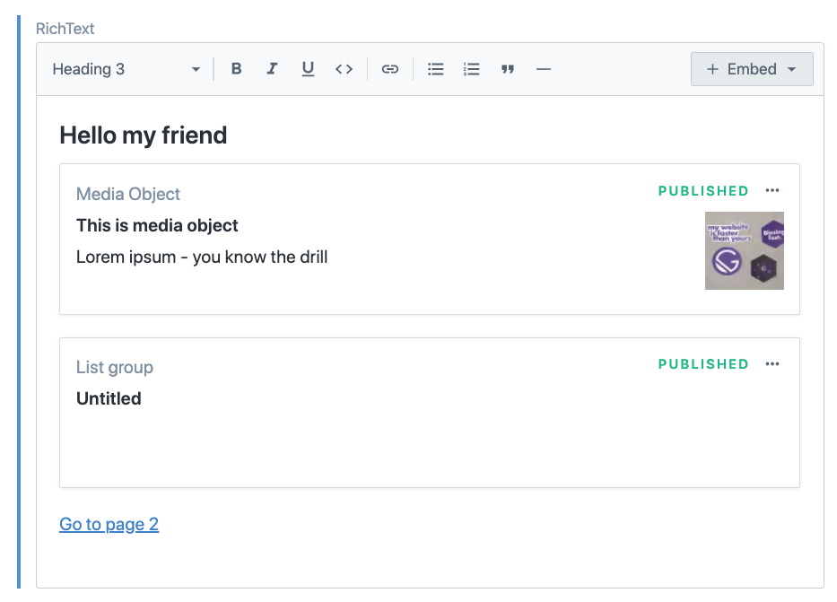
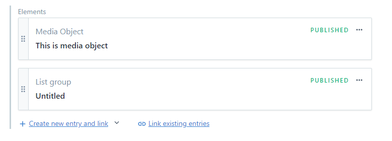

## Problem description:

Currently there is no good way to add dependencies to webpack bundles in cases where those depend on data. Examples of those are:

- `gatsby-plugin-mdx` where users can add arbitrary import statements in their `.mdx` files
- page builders where CMS provides set of components and page template then need to map those to actual react components. Right now page template need to import all possible components and determine which to use in template.

There are currently 2 approaches to this and each have its own problems:

1.  Use lazy loading (`loadable-components` / `react-loadable` / custom solutions using dynamic imports):
    - This means we don't load unneeded chunks as only what's needed get fetched
    - It also means there is request waterfall: we first need to load page template chunk, evaluate and run it and only then we star fetching resources for those additional components. It also mean that first paint of page doesn't show those components (it can show placeholders) so there also is bad UX involved with content jumping around. It also might cause problems with SSR depending on the solution (either render placeholders in SSR, or render final one - but then there are hydrations issues)
2.  Add every potentially needed components into page template or app chunks. This cause fetching and parsing more js that is needed.

## Proposed API:

### `context.pageModel.addModule`

This is responsible for adding given module to webpack bundle (if it didn't exist yet) and to add it to `page-data.json` / `app-data.json` so runtime loader knows that it is page/app dependency it needs to fetch.

```js
const identifier = context.pageModel.addModule({
  // TBD figure out who should be responsible for handling local paths - do we require either absolute path or node_modules package name?
  // Example of something that is unclear what would be responsible for resolving: `import Something from "../../src/components/component-used-in-mdx"`
  source: `some-module`,

  // fields below are optional

  // import type:
  //  - default (`import DefaultExport from "some-module"`)
  //  - named (`import { NamedExport } from "some-module"`)
  //  - namespace (`import * as Namespace from "some-module")
  // default type is `default`
  type: `default` | `named` | `namespace`,

  // optional - only for `named` type (`import { NamedExport } from "some-module"`)
  import: `NamedExport`,
})
```

Return value of this function (module identifier) will be used in frontend code to access modules.

If you want to include multiple named exports - you call `context.pageModel.addModule` (with same `source`) multiple times for each named export.

Using `context.pageModel.*` also allow to cheaply add more kind of dependencies to a page in future - examples:

- critical asset resources like images/fonts that would only need to preload
- json payloads that don't need to be handled by webpack

NOTE: in this proposal, this is only available in graphql resolvers and not in general gatsby-node context. Reason for it is that Gatsby being in charge of running queries makes it easier to avoid weird edge cases and only thing that need to be coordinated is query running and webpack using this limitation. Additionally gatsby is aware what page query is run for, so users don't need to handle assigning modules to particular pages, because this is done behind the scenes. On top of that we already have query results invalidation that will also handle cases of removing stale modules, which otherwise would be responsibility of users/plugins and given our experience with caching problems in 3rd party code I think it's safe assumption that if users/plugins would be responsible for it it wouldn't be done correctly (it would also be heard to teach / document).

### `import { getModule } from "gatsby"`

`context.pageModel.addModule` API makes sure modules are bundled and are loaded. We still need a way to access those in frontend code.

```js
import { getModule, graphql } from "gatsby"

...

const someModule = getModule(moduleIdentifier)
```

API is low-level and primary usage is meant for plugins (like MDX), but users could make use of it in their sites as well for scenarios like Page Builders that you assign each block in CMS to particular component in your source code.

Use case like this is perfect, because we will load only components that given page needs and not all the components available.

```jsx
import { getModule } from "gatsby"

const PageTemplate = ({ data }) => {

  return <>
    {data.listOfPageBuilderElements.map(({ moduleID, data}) => {
      const Component = getModule(moduleID)

      return <Component data={data} />
    })}
  </>
}

export pageQuery = graphql`
  {
    listOfPageBuilderElements {
      moduleID
      data
    }
  }
`
```

In future this will become hopefully more manageable with GraphQL Components / Query data processors that would abstract usage of `getModule` from user's code.

As alternative to `getModules` this could be just set as page prop (or maybe both of those could be implemented). I don't have strong opinions on frontend part of the API.

### (optional) `actions.registerModule`:

While this part of API is not needed to make it work. Users/plugins being able to explicitly register modules (without tying them to pages yet) is something to consider. Consider scenario when there is component that is used from time to time (for example "limited-time offer component"). If the component is added to webpack deps only when it's used means there will be webpack hash change every time when component is added/removed forcing Gatsby to rewrite all .html files. Ensuring that component is bundled (even if it's not used) can stabilize webpack hashes and avoid the need to rewrite all .html pages because of content change.

## Technical details

This API has few parts:

1. Adding dependencies to webpack bundles
2. Making runtime aware of additional resources
3. Invalidating stale modules
4. Adoption strategy
5. Tangential: Impact on server/hosting/cdn configuration
6. Very tangential: feature checking

### 1. Adding dependencies to webpack bundles

Requirement here is that all dependencies are registered before we run webpack. For regular `gatsby build` as well as initial (bootstrap) run for `gatsby develop` and incremental builds this is pretty straight forward, because everything runs linearly one after another.

There will need to be adjustment so page queries in `gatsby build` run before webpack (side note - I think we could just do it right now, because page queries don't seem to rely on webpack for anything - in past we did run them after page queries because we were writing webpack compilation hash in page-data files, but we don't do it anymore).

For `gatsby develop` and incremental builds we will need to coordinate query running and webpack compilation to ensure:

- (gatsby develop) it's not wasteful so we don't run webpack, then query running potentially invalidating webpack again and then webpack again. I think this can be done with webpack's pause/resume - so query running will block webpack compilation and it will be able to resume after query running finishes. Similarly if we are in middle of webpack compilation we should pause query running to avoid lot of back and forth and batch work as much as possible.

I plan to use `requires-writer` to add registered modules to `(a)sync-requires` files. I will need to move it a bit to ensure it runs after modules were registered - so earliest it can happen will be right after initial query running and before webpack.

For `async-requires` I plan to use familiar dynamic import map (that we already use for page templates). There is nuance to that because dynamic imports don't really support pulling singular imports (to allow for tree shaking) so I will need extra indirection ("glue re-export") to allow tree shaking in case of default/named imports (if plugin/user import entire namespace - `import * as X from "x"` - we can dynamically import those directly without glue). For import types that need glue code - instead of writing actual files to fs, we can use [`webpack-virtual-modules`](https://www.npmjs.com/package/webpack-virtual-modules) to create the glue modules on the fly. Those glue modules would be one liners like `export { namedExport as default } from "some-module"`

### 2. Making runtime aware of additional resources

For modules added as part of page queries this is straight forward. Queries are already tied to pages, so it's just matter of adding those modules as page dependencies and making sure when we write `page-data` files we add list of required module ids to it. Loader then can read that list and fetch them as part of resource loading. Note - there is already request waterfall today (we read page-data file -> get page template chunk name -> fetch page template chunk), so while not ideal to add more requests like that payoff seems worth it (especially that this API add ability to remove unused code from app or page template chunks, so those extra requests would be only for pages that need them). After fetching modules we put them in `module_id -> module` map that is somewhat globally available and add method to grab module by `module_id`. I was thinking of adding those as page props, but with users potentially using it static queries this won't work (unless we change signature of static queries to return `{ result, modules }` instead of just `result` - that would be a breaking change). Additionally this is a low level API that is not meant for massive adoption and usage by end users directly - ideally various plugins will make use it under the hood, potentially adding nice abstraction over it. There is also follow up work: "Graphql components"/"Page data processors" that would internally use this API and would be bit more higher level (more suited for end user usage).

Static queries currently are difficult to support because they skip our resource loading (as they are completely managed by webpack and "we don't have to worry about it"). While we could use some kind of webpack loader to make sure those are handled, there is unrelated concern about static queries being handled by webpack: (data changes invalidating webpack compilation hash and forcing rebuild of every html page). Because there is work already done to untie static query results from webpack and make them handled by our resource loader (by figuring out which pages do need to load which static query results and adding metadata to page-data files about it), my work will depend on those efforts for static query results support. After list of static query results needed to load for a given page is calculated, I will check those and lift any module dependencies from static queries up to page data as well.

This feature does need to work both for browser bundle as well as for SSR. Ideally SSR mimics browser closely so any problems with not catching all the required dependencies would be caught at build time and not after sites are deployed.

### 3. Invalidating stale modules

We already have mechanism for invalidating page query results. Because this API relies on query running we can hook into this invalidation to remove stale modules. Note: with optional `actions.registerModule` we also need to make sure to not invalidate modules registered with that action completely as users tries to force those modules.

### 4. Adoption strategy

As mentioned previously - this is low level API. For pure correctness reasons it means that this is not very straight forward for users to use and benefit from. API is not good if our users can't utilize it. Nature of API (deriving module dependencies from data) makes it impossible to create fully generic higher level APIs baked into core - they will always be dependent on shape of data and will require some custom graphql field resolvers. We do however already have abstractions for this - those are source and transformer plugins. Those seem like natural spot to support new APIs and abstract gnarly parts from the user (this is somewhat similar situation to schema customization or even node creation in sense that complexity of those is hidden/abstracted from users).

In the problem description section I mention to primary cases - MDX and page builders. Changes to MDX will be purely internal meaning that users will not have to change any of their code (unless they heavily rely on `MDXProvider` or `gatsby-plugin-theme-ui/components` - which uses MDXProvider internally which would still place used components in `app` chunk). This is because `gatsby-plugin-mdx` already provides nice APIs to consume query results (`MDXRenderer`) which will be used to hide usage of `getModule` in frontend code and the resolver is already in place so the way users interact with this plugin will remain unchanged.

If you squint hard enough - this is actually single case because MDX can be considered page builder as well. When you look at it this way - the way forward for other plugins would be "copy" this convention and provide "Renderer" functions for users to use.

#### Contentful example

To illustrate this I will use example of using Contentful as data/content source and how we can bake usage of this API into this plugin. Existing Contentful primitives allow users to setup page building in 2 ways: a) using [Rich Text](https://www.contentful.com/developers/docs/concepts/rich-text/) and b) using reference/link field that allow multiple entries and allow multiple types. Before diving into differences between those let's cover common area:

In both cases we would like to map Contentful types to React components. This can be done in few ways (not mutually exclusive - in fact those could be combined by users depending on specific needs):

- use `gatsby-source-contentful` plugin options to map Contentful types to React components - this would be global setup and similar to what Providers in react land do (but for our case it's better than providers, because nature of providers is that it's very hard to code split):
  ```js
  {
    resolve: `gatsby-source-contentful`,
    options: {
      // need better plugin option name - ideally we come with name convention that can be shared in other plugins (prismic, dato, etc) as well so setup is consistent
      typeToComponent: {
        "NameOfContentTypeInContentful": require.resolve(`./src/components/some-component`),
        // insert as many entries as needed
      }
    }
  }
  ```
- use arguments in graphql queries (this might be cumbersome to use, but in cases when user would want to change presentation in some templates - this would allow to override global plugin settings). Concrete examples of this flow depend on setup (rich text vs reference fields), so examples will be shown later.

Ideally we would discourage usage of Providers because those makes it very difficult to properly code split. It's not impossible but it requires some form of static analysis and would be very brittle (as static analysis need to be aware of how component tree is composed to properly resolve which component should be used etc - we can somewhat guarantee correctness if there is single provider, but if there are multiple nested ones it becomes unfeasible and likely we would have to opt out of this kind of optimization to not cause incorrect and unexpected behavior)

Let's dive into specifics of possible page builder setups:

#### a) Contentful Rich Text

Rich Text is somewhat WYSIWIG style field that allow users to format text as well as "embed" entries of other types. For reference see screenshot below - in there I have some text as well as embedded "Media Object" and "List group" elements.



This case is very similar to MDX AST in terms of handling content on Gatsby side - rich text fields return hierarchical JSON blob with nodes having types. Types can be builtin (paragraphs, links, headings, etc) or ones that use defines in their Contentful space content model (and those extra ones are what we would like to map to specific React components).

We could extend existing `json` resolver for rich text fields or create additional (enhanced) one that would tell gatsby that it needs to add components used in particular field instance to "current page" (page we execute query for). We can use mapping declared in plugin options and/or make the `json` field in graphql accept optional arguments that would map Contentful types to components:

```graphql
{
  contentfulPageBuilderType(<filter>) {
    richTextField {
      # json or jsonWithComponents return JSON type
      # all arguments used for component mapping are optional (they would be merged with mapping provided in plugin options)
      jsonWithComponents(MediaObject:"<path_to_component>")
    }
  }
}
```

The second part is how users will render this in React land. As I mentioned we can take clues from MDX ... but also from helper library that Contentful already have for Rich Text fields ( [`@contentful/rich-text-react-renderer`](https://www.npmjs.com/package/@contentful/rich-text-react-renderer)). We could wrap `@contentful/rich-text-react-renderer` with additional logic to handle `getModule` and users then would consume result of query like this:

```jsx
import { RichTextRenderer } from "gatsby-source-contentful"

const TemplateComponent = ({ data }) => {
  return (
    <RichTextRenderer>
      {data.contentfulPageBuilderType.richTextField.jsonWithComponents}
    </RichTextRenderer>
  )
}

export default TemplateComponent

// graphql query left out for brevity - but consider it would be similar to one shown above
```

With Graphql Components this could just turned into something like this

```jsx
const TemplateComponent = ({ data }) => {
  return data.contentfulPageBuilderType.richTextField.Component
}

export default TemplateComponent

export const pageQuery = graphql`
  {
    contentfulPageBuilderType(<filter>) {
      richTextField {
        Component(MediaObject:"<path_to_component>")
      }
    }
  }
`
```

Above snippet is speculative, TBD on details of Graphql Components, but idea is that users wouldn't have to use `<RichTextRenderer>` and graphql result would provide it for users

#### b) Contentful reference links

Reference field is very structured in strict. Users wouldn't be able to use free form text (unless they create Text content type). Simalarly to previous example I use similar content ("Media Object" and "List group" entries):



This case is quite different than previous when it comes to querying for data. We no longer have "JSON" blob - instead we have graphql union and need to select fields individually (as well as use (inline) fragments for each possible type). This makes it a bit more overhead to work with ... but also gives a lot more control.

In this case we will likely have to add `moduleID` (or similar) field on each possible type and users would be required to query for it (we can't hide this as we did with rich text example).

Example of usage could look like this:

```jsx
import { graphql, getModule } from "gatsby"

const TemplateComponent = ({ data }) => {
  return (
    <>
      {data.contentfulPageBuilderType.referenceField.map(({moduleID, ...props}) => {
        if (!moduleID) {
          return null
        }

        const Component = getModule(moduleID)
        return <Component {...props} />
      })}
    </>
  )
}

export default TemplateComponent

export const pageQuery = graphql`
  {
    contentfulPageBuilderType(<filter>) {
      referenceField {
        ... on ContentfulListGroup {
          moduleID
          ...ListGroupFragment
        }
        ... on ContentfulMediaObject {
          moduleID
          ...MediaObjectFragment
        }
        # more types to handle
      }
    }
  }
`
```

Similarly - we could abstract "renderer" part that would hide usage of `getModule` (same as rich text renderer). What we can't hide however is querying for `moduleID` (at least today).

Similarly to rich text we could allow optional argument to `moduleID` field to overwrite global plugin options - just in this case it would be singular argument as those are already tied to single type:

```graphql
... on ContentfulListGroup {
  moduleID(component: "<path_to_component>")
  ...ListGroupFragment
}
```

Note how I used additional fragments for each type - this is so our React component can declare fields they need via fragments.

Similar to rich text case - with Graphql component we potentially could query for `Component` field:

```jsx
import { graphql } from "gatsby"

const TemplateComponent = ({ data }) => {
  return (
    <>
      {data.contentfulPageBuilderType.referenceField.map(({ Component }) => Component
    </>
  )
}

export default TemplateComponent

export const pageQuery = graphql`
  {
    contentfulPageBuilderType(<filter>) {
      referenceField {
        ... on ContentfulListGroup {
          Component
        }
        ... on ContentfulMediaObject {
          Component
        }
        # more types to handle
      }
    }
  }
`
```

### 5. Tangential: Impact on server/hosting/cdn configuration and (potentially) offline plugin

Additional split chunks means we have to add extra `<script>` tags in html we render. This is part is not a problem. Problematic part is integrations with hosting providers (like Netlify with gatsby-plugin-netlify). Gatsby currently doesn't have any form of API that those plugin can use and what they do to setup [Server (no)push](https://w3c.github.io/preload/#server-push-http-2) is essentially replicate a lot of our code in `static-entry` themselves (for javascript/webpack generated resources: reading webpack.stats.json and figuring out which chunks are used for each page). This means to support it properly we will need to adjust at very least `gatsby-plugin-netlify` (are there any other plugins like that?).

Similarly we might need to look into resource precaching setup in offline plugin to figure out if it needs adjustments or if it will work as-is.

While this on itself is not huge problem (I would do that either as part of main pull request or as related PR). We might want to start talking about providing some API that plugins like that can hook into. Splitting static query results from webpack handling is another case where we put handling like this in hands of those plugins.

### 6. Very tangential: feature checking

There is common problem with Gatsby plugins and new APIs is that plugins trying to make use of new APIs just break on older version of Gatsby. This often requires doing MAJOR version bump and declaring that plugin requires Gatsby core version ^x.y.z (whenever API was implemented). This however is problematic for users, because it's on them to keep track of things like that and they won't get benefits "for free".

Testing for existence of some APIs is one way to go about it now, but it only works in limited number of scenarios. For example - you can't do that for `gatsby-X.js` hooks (like `createSchemaCustomization`). You also wouldn't really be able to do that here. At the time you get to calling field resolvers (when users would first get ability to call `context.pageModel.addModule`) - this would already be too late. There is lot of logic that happens before that right now which could be disabled if plugin knew that API exists (different code path).

I would really love to have `@supports`-like (CSS-inspired) function in Gatsby that would help plugin authors and plugin users (in my opinion)

## Prior art

Initial idea for tying this API heavily to query running and resolvers was inspired by Relay data-driven code-splitting:

